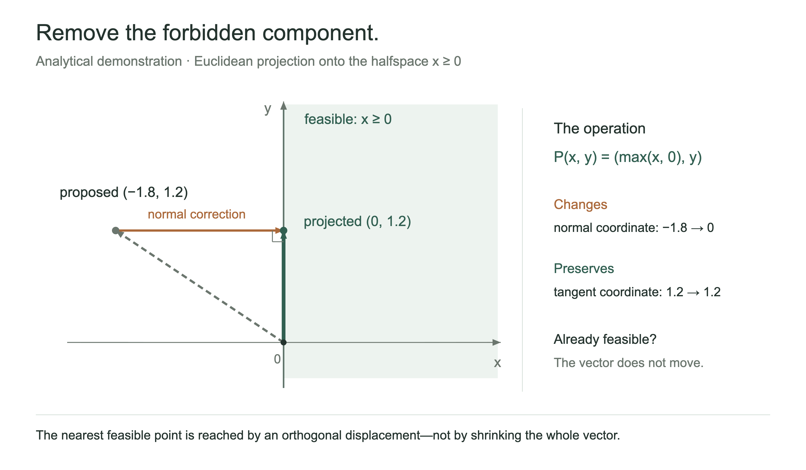
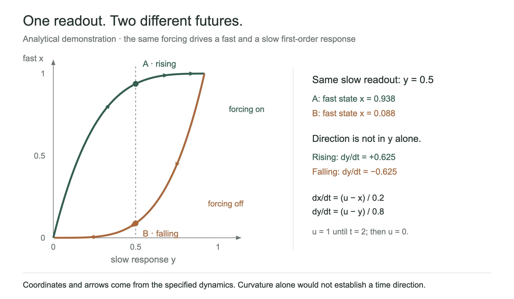

# MechanismFigures

**An installable agent skill for figures that reveal how a scientific system works.**

SciencePlots supplies plotting styles. MechanismFigures supplies a mechanism-to-figure reasoning workflow: isolate the relationship, choose a faithful visual construction, implement it, inspect it, and revise against an evidence-linked quality gate. It is not a Matplotlib style sheet, autonomous model, or promise of automatic publication-quality results.

## Install

```bash
git clone https://github.com/KumarNavish/MechanismFigures.git
python3 MechanismFigures/tools/install.py
```

The offline installer copies one self-contained folder to `~/.agents/skills/mechanism-figures`. Python 3.9+ standard library only; no pip install, API key, model call, telemetry, or configuration edit. Existing or modified skills are preserved. Verify with `python3 MechanismFigures/tools/install.py --check`.

For a project-local installation, use `--dest /path/to/project/.agents/skills`. Other Agent Skills-compatible hosts can install the same `skills/mechanism-figures` folder at their supported skill location. Reload skill discovery where necessary. A skill grants no tool permissions; the host must provide image inspection and file-editing capabilities.

## Give the agent four inputs

```text
Use $mechanism-figures.
Project context: ...
Scientific mechanism or result: ...
Available data and evidence: ...
Output constraints: audience, dimensions, formats, accessibility, and budget.
```

The agent fills the working contract; the user need not complete a long questionnaire. In a host without named-skill invocation, ask it to read the installed `SKILL.md` explicitly.

**[Start the skill](skills/mechanism-figures/SKILL.md)** · **[Browse calibration cases](skills/mechanism-figures/references/calibration-index.md)** · **[Anchored rubric](skills/mechanism-figures/references/critique.md)**

## The operational path

`four inputs → claim and falsifier → two constructions → actual reference inspection → encoding map → rough mechanism → implementation → rendered critique → repair`

The compact entry point loads only the decision guide, rubric, and two relevant reference cases. Deeper fidelity and implementation guidance are separate. A persistent `figure.json`, hash-bound review records and append-only revision log preserve the decisions across agents and sessions.

### A quality gate that cannot be passed by a good average alone

Acceptance requires **≥90/100**, **every dimension ≥4/5**, **scientific fidelity =5/5**, and **all ten hard gates passed**. Weights are:

| Dimension | Weight |
|---|---:|
| Mechanistic insight | 18 |
| Scientific fidelity | 20 |
| Visual intuition | 12 |
| Information hierarchy | 8 |
| Encoding originality | 6 |
| Compositional clarity | 8 |
| Annotation quality | 6 |
| Aesthetic refinement | 8 |
| Publication readiness | 8 |
| Immediate comprehensibility | 6 |

Scores must point to actual observations. Changed contracts, data, source or output files invalidate old reviews. Missing evidence, failed captionless predictions, unknown hard gates and weak dimensions block acceptance. Repair meaning before polish; switch construction after repeated non-improvement. A budget-limited, subthreshold figure is returned honestly as unfinished—not upgraded by lowering the bar.

**Automation does not judge aesthetics or authenticate science.** Scripts check declared structure, paths, file integrity, basic SVG constraints, and recorded review policy. `self_review_pass` is explicitly not independent validation. `--require-independent` requires a separate named review and preserved response record; identity and truthfulness remain auditable attestations. See [the evaluation protocol](benchmarks/PROTOCOL.md).

## Commands an agent uses

```bash
# Run from the installed skill folder, or use an absolute script path.
python3 scripts/mf.py init /path/to/new-figure-work
python3 scripts/mf.py references --group dynamics
python3 scripts/mf.py reference cellrank
python3 scripts/mf.py validate /path/to/new-figure-work/figure.json
python3 scripts/mf.py preflight /path/to/new-figure-work/figure.json
python3 scripts/mf.py review-init /path/to/new-figure-work/figure.json --out /path/to/new-figure-work/review-r1.json
# After actual visual/scientific review, not immediately after initialization:
python3 scripts/mf.py gate /path/to/new-figure-work/figure.json /path/to/new-figure-work/review-r1.json
```

Add a second review file and `--require-independent` for the stronger recorded-review status. Blank templates and reviews cannot pass. The stored reproduction command is never executed by the gate.

## Real visual calibration, with explicit rights

All **20 published reference guides** retain the mechanism, a three-step reading path, a project-specific mapping, a three-step construction recipe, a falsifiable acceptance test, and what not to copy. The public edition bundles **12 actual images from seven references** with verified CC BY 4.0 reuse permission. Other entries link to their originals rather than silently relicensing their image bytes.

Open [`assets/gallery.html`](skills/mechanism-figures/assets/gallery.html) locally alongside its image folder, or open the gallery from the release ZIP. It has search, mechanism-family filters, focused/full-image links and per-source credits. No remote image hotlinks or generated substitutes. **[Third-party credits and license audit](THIRD_PARTY.md)**.

## Worked analytical examples

These are original toy constructions, **not reproduced research findings or independent quality-benchmark outcomes**. Both retain source, exact data, SVG/PNG, caption, contract, first-draft artifacts and observed repairs.

[Projection: remove only the forbidden component](examples/generated/projection/figure.svg)



[Coupled lag: equal readout, different futures](examples/generated/lag/figure.svg)



Generate SVGs and data with `python3 examples/render_examples.py`. PNG previews use an existing renderer; `tools/render_svg.mjs` is an optional Node 22+ helper for an already installed Chrome/Chromium. It downloads no browser. Rendering tools are not dependencies of the installed skill's reasoning and quality-checking helpers.

## Validation and limits

```bash
python3 -m unittest discover -s tests -v
python3 tools/check_repo.py
python3 tools/build_gallery.py
```

Engineering regression tests, installation checks and analytical examples are shipped. **No cross-agent efficacy study has been run.** The eight public diagnostic tasks and matched independent-review protocol measure pass rate, false mechanistic claims, variance and full costs; they are not a held-out test set. See [validation evidence](docs/VALIDATION.md) and [benchmark protocol](benchmarks/PROTOCOL.md). The score thresholds are demanding design policy, not empirically calibrated guarantees.

## Repository map

- `skills/mechanism-figures/`: the complete, portable installed skill.
- `tools/`: installation, packaging, generation, deterministic checks and descriptive benchmark reporting.
- `tests/`: adversarial tooling regressions; synthetic review fixtures are never empirical evidence.
- `examples/`: exact analytical constructions and an inspected repair history.
- `benchmarks/`: frozen diagnostic packets and a fair evaluation protocol.

Original code and editorial material: MIT. Third-party images retain their individual licenses and attribution. No source author endorses this skill. See [contribution rules](CONTRIBUTING.md).
