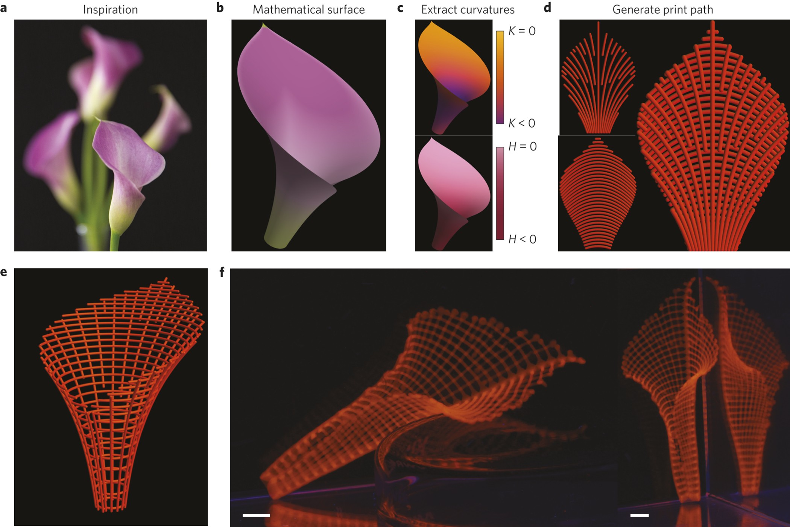

# MechanismFigures

**Turn a scientific mechanism into a figure the reader can reason with.**

An installable agent skill—not a plot theme. It takes project context, a mechanism/result, evidence, and output constraints through real visual calibration, composition, implementation, rendered critique, and refinement.

**[Start here](START_HERE.md)** · **[Reference gallery](https://kumarnavish.github.io/MechanismFigures/skills/mechanism-figures/assets/gallery.html)** · **[Watch the workflow](https://kumarnavish.github.io/MechanismFigures/skills/mechanism-figures/assets/motion.html)** · **[Releases](https://github.com/KumarNavish/MechanismFigures/releases)**

## 1. Install once for your local agents

```bash
git clone https://github.com/KumarNavish/MechanismFigures.git
cd MechanismFigures
python3 install.py --global --agents all
python3 install.py --doctor
```

Already installed? Run `python3 install.py --global --agents all --update` from the new checkout.

One canonical skill lives in `~/.agents/skills/mechanism-figures`. Documented local routes cover **Codex, Claude Code, Cursor, Gemini CLI, OpenCode, GitHub Copilot, Windsurf/Devin Desktop, and OpenClaw**. Required host adapters point to the same version; verified copies are available where symlinks are unavailable. Conflicts are detected before changes, previous managed versions are retained, and interrupted transactions have an explicit recovery path.

Python 3.9+ standard library only. **No model runner, API key, paid service, telemetry, global prompt rewrite, or permission change.** `--dry-run` plans without writes. [Installation and recovery](docs/INSTALL.md).

**Global is user-scoped on this machine, across projects—not automatic installation into every web/mobile account, remote worker or chat.** Refresh the host and explicitly select the skill when necessary. Root `plugin.json` and the local marketplace catalog package the same skill for supported plugin flows; GitHub publication is not a universal plugin-directory listing. [Exact host and account boundaries](docs/HOSTS.md).

## 2. Give the agent four inputs

```text
Use mechanism-figures for this scientific figure.
Project context: …
Mechanism or result: …
Data and evidence: …
Output constraints: audience, dimensions, formats, and budget.
```

In Codex use `$mechanism-figures`; in Claude Code use `/mechanism-figures`. Other hosts use their skill picker or explicit request. The agent fills the working contract; you do not need to complete a long form.

## 3. The agent follows a concrete workflow

**Understand → isolate one insight → compare two constructions → inspect two real references → map the encoding → compose → implement → critique → repair.**

| Decision | Required evidence of completion |
|---|---|
| What must the reader see? | A specific relationship, assumptions, comparator, evidence status and falsifier. |
| Which visual construction fits? | Two representations compared for insight and distortion—not two palettes. |
| What did the agent learn from the images? | Actual registered image paths/hashes plus concrete composition, encoding and style observations. |
| Does the result tell the truth? | Every meaningful visual relation maps to evidence, units or an explicitly labeled schematic. |
| Is it finished? | Editable vector, inspected preview, caption, generating source/evidence and version-bound review. |

[Skill entry](skills/mechanism-figures/SKILL.md) · [Load-only-what-you-need index](skills/mechanism-figures/references/INDEX.md) · [Quality rubric](skills/mechanism-figures/references/critique.md).

## A curated visual standard—not self-generated examples

The gallery contains **20 real published references and 29 original figure assets**. Eight user-retired entries were replaced with new, visually inspected constructions; twelve retained references preserve their original image bytes. The current set includes inverse optical design, constrained protein denoising, photonic braiding, material programming, dynamic mechanical fronts, spatial layer decomposition and three-dimensional tissue packing.



Every case explains **mechanism → visual construction → perceptual insight → project transfer → failure test**, with source-specific scientific limits. The image above is a published reference, not a result produced by this skill. [Curation decisions and replacements](docs/CURATION.md) · [Original sources, figure treatment and rights](THIRD_PARTY.md).

## Quality control that cannot hide a weak dimension

The anchored rubric requires **≥90/100 overall**, **every dimension ≥4/5**, **scientific fidelity 5/5**, and **all ten hard gates passed**. Dimensions cover mechanism, fidelity, intuition, hierarchy, encoding, composition, annotation, visual refinement, publication readiness and immediate comprehension.

Reviews require observations from the actual render, captionless prediction checks, final-size/grayscale inspection and comparison with the same reference images. Changed claims, source, evidence, figures or rubric invalidate old reviews. Repeated non-improvement triggers a new construction, not score inflation.

The helpers verify file structure, hashes and review records. **They do not automatically judge beauty, prove scientific claims, or authenticate a reviewer.** Self-review and independent-review statuses remain distinct. No cross-agent efficacy study has been completed; [the evaluation protocol](benchmarks/PROTOCOL.md) defines the matched comparison needed to establish reliability.

## Minimal navigation

| You want to… | Enter here |
|---|---|
| Install, update or verify | [docs/INSTALL.md](docs/INSTALL.md) |
| Understand local versus account scope | [docs/HOSTS.md](docs/HOSTS.md) |
| Create or refine a scientific figure | [SKILL.md](skills/mechanism-figures/SKILL.md) |
| Inspect the current visual standards | [Reference index](skills/mechanism-figures/references/calibration-index.md) |
| Maintain the repository | [docs/MAINTAINING.md](docs/MAINTAINING.md) |

Original code and commentary are MIT licensed. Third-party figures retain their own rights, source credits and reuse limits; they are not relicensed by this repository.
